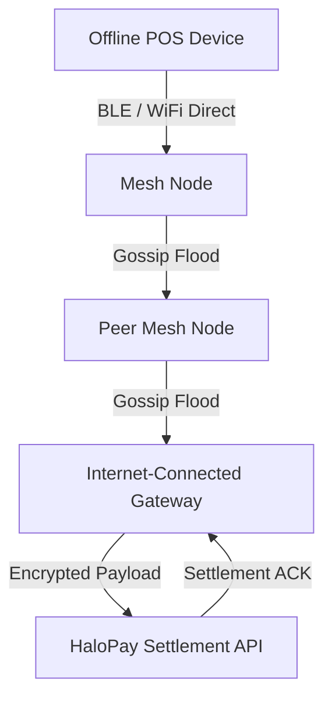

<h1 align="center">HaloPay Mesh Relayer</h1>

<p align="center">
  A robust, asynchronous Rust daemon designed to facilitate offline transaction settlement in humanitarian zones. It forms a resilient mesh network across POS hardware using BLE and local WiFi direct links to route encrypted payloads out of internet-blackout areas.
</p>

<p align="center">
  <a href="https://github.com/HaloPaye/halopay-mesh-relayer/actions"></a>
  <a href="LICENSE"></a>
  
</p>

---

## Core Architecture

The project is structured as an Enterprise Cargo Workspace, splitting concerns into highly optimized and testable crates:

1. **mesh-crypto**: Core cryptographic primitives including Ed25519 signing, BLAKE3 hashing, and ChaCha20 encryption.
2. **mesh-protocol**: Message serialization, binary types, and the highly efficient 256-byte fragmentation protocol.
3. **mesh-storage**: SQLite persistence schema, mempool state management, and LRU caches.
4. **mesh-transport**: Hardware layer abstractions for Bluetooth Low Energy (BLE), LoRa, and Simulation traits.
5. **mesh-node**: The core daemon orchestrator, gossip flood routing logic, and HTTP API settlement client.
6. **mesh-tui**: A `ratatui`-based terminal dashboard to visualize network topology and settlement states in real-time.

### Architecture Diagram



### The Hard Problem: Offline Double Spending

In humanitarian zones without stable internet, merchants must still accept digital USDC payments securely. However, the inability to verify balances in real-time creates a significant attack vector: offline double-spending.

This relayer solves this problem using a deterministic conflict resolution rule natively executed in the mesh layer:

1. **Cryptographic Signatures**: Every transaction is cryptographically signed using Ed25519 by the merchant's POS device.
2. **Conflict Detection**: If two nodes broadcast conflicting transactions (i.e. same monotonic nonce, same merchant key, but different payloads or signatures), the network mempools instantly detect the anomaly.
3. **Deterministic Resolution**: The rule is strictly mathematical — **The transaction whose Ed25519 signature produces the lowest BLAKE3 hash wins.**
4. **Damage Control**: The losing transaction is dropped entirely across the mesh, and a `SettlementFailed` ACK is routed back to the offending UI.
5. **Exposure Limits**: All routing guarantees are strictly mathematically bound to max damage isolation limits (e.g., a maximum of 500 USDC total offline exposure per partition).

---

## Stellar & Soroban Architecture Integration

The HaloPay Mesh Relayer serves as the resilient offline-to-online bridge for the Stellar network:

* **Offline Transaction Encapsulation:** When internet connectivity is lost, HaloPay POS terminals sign Stellar payment envelopes locally. The mesh relayer breaks these envelopes into deterministic 256-byte fragments and propagates them across peer nodes via BLE and LoRa gossip.
* **Deterministic Double-Spend Prevention:** Before transactions reach an internet-connected gateway, mesh nodes execute BLAKE3 deterministic ordering on Ed25519 signatures, ensuring conflicting nonces are eliminated peer-to-peer without requiring synchronous ledger queries.
* **Soroban RPC & Horizon Ingestion:** When any mesh peer encounters an active internet gateway, it acts as a relayer, reconstructing the signed transaction envelopes and dispatching them to the HaloPay Settlement API or directly to Stellar Horizon and Soroban RPC nodes for on-chain finality.

---

## Tech Stack

- **Language**: Rust
- **Core Daemon**: Tokio (Async Runtime)
- **Cryptography**: Ed25519, BLAKE3, ChaCha20
- **Database**: SQLite (local persistence & mempool)
- **Monitoring**: `ratatui` (Terminal UI)
- **Transport**: BLE, LoRa, WiFi Direct

---

## Setup & Quick Start

A standard `Makefile` is provided for CI and deployment commands:

```bash
# Clone the repository
git clone https://github.com/HaloPaye/halopay-mesh-relayer.git
cd halopay-mesh-relayer

# Build the workspace
make build

# Run unit tests
make test

# Lint and format code
make lint

# Cross-compile for Raspberry Pi / ARM architectures
make cross-compile-arm
```

### Running the Simulation Harness

To evaluate the system, we provide a massive simulation harness that bootstraps virtual nodes (A, B, C, D) connected via in-memory broadcast channels, mimicking an unstable physical environment.

```bash
# Run the simulation harness and launch the TUI dashboard
make run-sim
# or: cargo run --bin mesh-sim
```

The simulation will run various topologies: Partition & Heal, Relaying, Disappearance, Malicious Injections, and Duplicates. The live TUI dashboard will provide a real-time visualization of mempool sizes, active peers, and scrolling gossip/settlement ACKs.

*Note: A `systemd` service file is included in `init/halopay-mesh.service` to deploy the daemon onto a Raspberry Pi or other POS hardware seamlessly.*

## Maintainers & Contact

| Maintainer | Contact / Telegram | Role |
| :--- | :--- | :--- |
| HaloPay Team | [@HaloPayDev](https://t.me/HaloPayDev) | Core Protocol Engineering |

## Contributors

[](https://github.com/HaloPaye/halopay-mesh-relayer/graphs/contributors)

---

## License

This project is licensed under the Apache License, Version 2.0 - see the [LICENSE](LICENSE) file for details.
