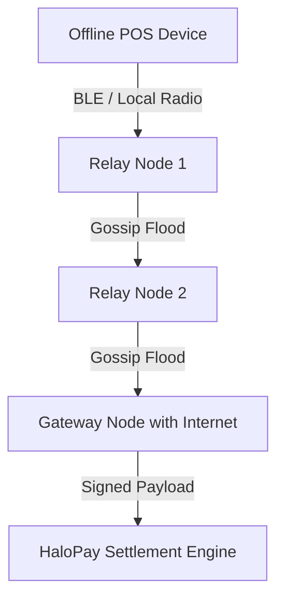

# HaloPay Mesh Relayer

An asynchronous Rust daemon for peer-to-peer store-and-forward transaction gossiping and deterministic conflict resolution across hardware partitions and internet blackout zones.

[](https://github.com/HaloPaye/halopay-mesh-relayer/actions)
[](LICENSE)
[](https://www.rust-lang.org)

---

## Overview

In telecommunication blackout areas, disaster zones, or rural regions, individual payment devices cannot connect to centralized servers. The **HaloPay Mesh Relayer** forms an ad-hoc local mesh across merchant terminals and battery-powered relay hardware using Bluetooth Low Energy (BLE), local WiFi, and LoRa links.

Transaction packets gossip across peer relays until reaching a node with an active internet gateway, where they are reassembled and dispatched for final settlement.

---

## Architecture (Cargo Workspace)

The relayer is designed as a modular Cargo Workspace with strict zero-allocation primitives where possible:



* **`crates/mesh-crypto`**: Cryptographic primitives including Ed25519 signature verification, BLAKE3 hashing, and ChaCha20-Poly1305 packet encryption.
* **`crates/mesh-protocol`**: Binary wire protocol, packet serialization, and 256-byte MTU fragment reassembly.
* **`crates/mesh-storage`**: SQLite persistence, write-ahead log buffers, priority queue mempool, and LRU peer ban lists.
* **`crates/mesh-transport`**: Abstractions for Bluetooth Low Energy (BLE), socket streams, and simulation harnesses.
* **`crates/mesh-node`**: Daemon lifecycle orchestrator, gossip routing engine, and outbound settlement clients.
* **`crates/mesh-tui`**: Terminal user interface for live monitoring of network topology and floating packets.

---

## The Hard Problem: Offline Double-Spending

In partitioned networks without synchronous ledger access, malicious or duplicate transactions must be handled deterministically without central coordinators. The Mesh Relayer resolves conflicting transactions mathematically:

1. **Cryptographic Identity**: Every transaction packet carries an Ed25519 signature generated by the originating terminal.
2. **Deterministic Conflict Resolution**: If two conflicting transactions share the same monotonic sequence or partition nonce, peer mempools apply a deterministic rule: **the signature producing the lowest BLAKE3 digest wins.**
3. **Consistent Convergence**: Because BLAKE3 digests are uniformly distributed and immutable, every isolated peer independently arrives at the exact same conclusion without exchanging additional consensus messages. Losing transactions are pruned immediately.

---

## Quick Start

### Prerequisites
- Rust 1.75+ (stable toolchain)
- Cargo

### Building & Testing

```bash
# Clone the repository
git clone https://github.com/HaloPaye/halopay-mesh-relayer.git
cd halopay-mesh-relayer

# Run test suite
cargo test

# Build release daemon
cargo build --release

# Run interactive terminal simulation harness
cargo run --bin mesh-sim
```

---

## Configuration

The daemon reads configuration from environment variables or `~/.halopay/config.toml`:
- `TRANSPORT_MODE`: `sim` (default simulation mode) or `ble` (hardware BLE peripheral mode).
- `API_URL`: Upstream settlement gateway endpoint.
- `MESH_NETWORK_ID`: 32-bit network partition identifier.

---

## License

Licensed under the Apache License, Version 2.0 - see [LICENSE](LICENSE) for details.
